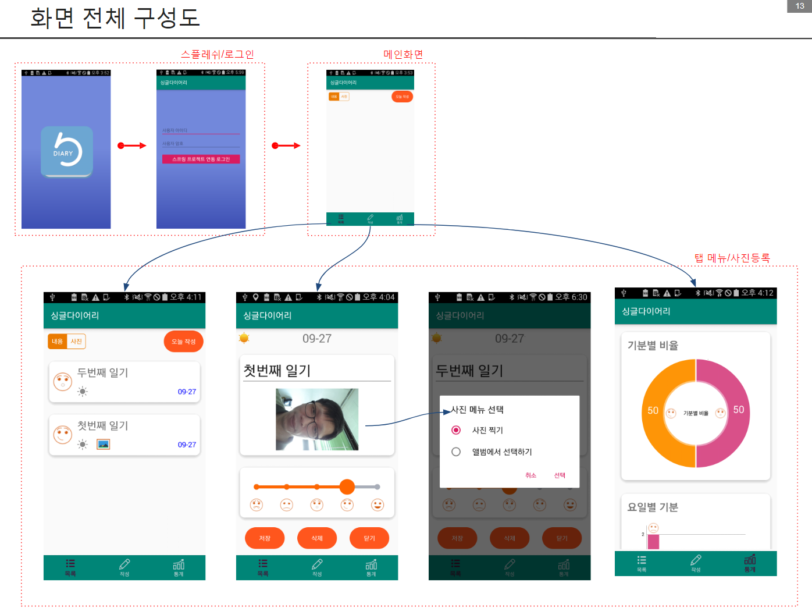

## Java기반 웹&콘텐츠 개발자과정 커리큘럼
 
---

- [학습목차](https://github.com/miniplugin/human22)
- 교사정보: 김일국, boramcom@daum.net, 010-8175-6075
- 학습목표
```
프로그래밍 능력, 운영체제능력, 네트워크 구축과 관리능력을 학습하고 IT취업을 위한 전문인을 양성
다양한 스마트기기 플랫폼에 적용이 가능한 웹 기반의 콘텐츠 서비스를<br> 
기획, 분석, 설계, 구현, 테스트, 배포 및 유지 보수를 할 수 있는 능력을 습득합니다. 
```
- [목차사용법]클릭, 예) [v1.0.0] <- 아래에서 해당부분 클릭하시면 해당과목으로 이동합니다.  

---

### [v1.0.0](https://github.com/miniplugin/human22/tree/app) UI디자인 (2001020707_17v2)

- 00월00일~00월00일(240시간) : 사전평가(00월00일) /사후평가(00월00일)
- 평가항목: 포트폴리오

### [v2.0.0](https://github.com/miniplugin/human22/tree/app) UI/UX 요구분석 (2001020704_17v2)

- 00월00일~00월00일(40시간) : 사전평가(00월00일) /사후평가(00월00일)
- 평가항목: 포트폴리오

### [v3.0.0](https://github.com/miniplugin/human22/tree/app) UI/UX 콘셉트 기획 (2001020705_14v1)

- 00월00일~00월00일(40시간) : 사전평가(00월00일) /사후평가(00월00일)
- 평가항목: 문제해결시나리오

### [v4.0.0](https://github.com/miniplugin/human22/tree/app) UI아키텍처 설계 (2001020706_14v1)

- 00월00일~00월00일(40시간) : 사전평가(00월00일) /사후평가(00월00일)
- 평가항목: 평가자체크리스트

### [v5.0.0](https://github.com/miniplugin/human22/tree/app) UI구현 (2001020708_17v2)

- 00월00일~00월00일(240시간) : 사전평가(00월00일) /사후평가(00월00일)
- 평가항목: 포트폴리오

### [v6.0.0](https://github.com/miniplugin/human22/tree/app) UI테스트 (2001020709_17v2)

- 00월00일~00월00일(40시간) : 사전평가(00월00일) /사후평가(00월00일)
- 평가항목: 포트폴리오

### 위 v1.0.0 부터 v6.0.0 까지는 안드로이드 앱 프로젝트 작업 순서는 아래와 같습니다.

- HumanApp01: 기획서 작성, 화면구성(스플레쉬 로딩 화면, 로그인, 리스트화면, 입력화면, 통계화면)
- HumanApp02: 내 위치확인, 날씨 연동(Volley 네트워크 스레드 라이브러리, Gson 제이슨 RestApi사용), 사진 연동(사진찍기, 앨범에서 선택)
- HumanApp03: SQLite 데이터베이스 연동 CRUD(저장, 리스트조회, 수정, 삭제), 통계 조회(차트 라이브러리 사용)
- HumanApp04: 한글 앱 이름 저장, 앱 실행 아이콘 변경, 다국어 추가(한글, 영문)
- HumanApp05: 스프링 프로젝트와 로그인 연동 처리
- v1.0.0 부터 v6.0.0 까지 과제물 기준파일 2가지(아래)
- 과제물v1_한줄일기장_아키텍처 아래(v1은 v2, v3, v4, v5, v6으로 변경해서 해당 내용을 채운 후 제출):
- https://drive.google.com/file/d/1ti-AoFWQ7fI_OvNBBxNJmghI_GE1yHws/view?usp=sharing
- 과제물v1_한줄일기장_화면설계 아래(v1은 v2, v3, v4, v5, v6으로 변경해서 해당 내용을 채운 후 제출):
- https://drive.google.com/file/d/1ZanFHjzTlMc7FZT94SfeC1bZ0RpoGKvs/view?usp=sharing


### [v7.0.0](https://github.com/miniplugin/human22/tree/v7.0.0) 화면구현 (2001020225_16v4)

- 00월00일~00월00일(48시간) : 사전평가(00월00일) /사후평가(00월00일)
- 평가항목(수준3) : 포트폴리오

### [v8.0.0](https://github.com/miniplugin/human22/tree/v8.0.0) 프로그래밍언어활용 (2001020215_15v3)

- 00월00일~00월00일(80시간) : 사전평가(00월00일) /사후평가(00월00일)
- 평가항목 : 문제해결시나리오

### [v9.0.0](https://github.com/miniplugin/human22/tree/v9.0.0) 서버프로그램 구현 (2001020211_16v4)

- 00월00일~00월00일(60시간) : 사전평가(00월00일) /사후평가(00월00일)
- 평가항목0 : 포트폴리오

### [v10.0.0](https://github.com/miniplugin/human22/tree/v10.0.0) 애플리케이션 요구사항 분석 (2001020219_16v4)

- 00월00일~00월00일(50시간) : 사전평가(00월00일) /사후평가(00월00일)
- 평가항목 : 포트폴리오


### [v11.0.0](https://github.com/miniplugin/human22/tree/v11.0.0) 애플리케이션 테스트 수행 (2001020227_16v4)

- 00월00일~00월00일(40시간) : 사전평가(00월00일) /사후평가(00월00일)
- 평가항목 : 문제해결시나리오

### [v12.0.0](https://github.com/miniplugin/human22/tree/v12.0.0) 애플리케이션 배포 (2001020214_16v4)

- 00월00일~00월00일(30시간) : 사전평가(00월00일) /사후평가(00월00일)
- 평가항목 : 평가자체크리스트


### 교재별 소스 정보(아래)

--- 
- Do It! 안드로이드 앱 프로그래밍
#### 최신버전4.0.1구글클라우드다운로드: https://drive.google.com/file/d/1X9wu2DCLJBbyuZ6BsIxV4U7wLsn-t6WW/view?usp=sharing
#### 무작정 따라하기 챕터3강의안 : https://slidesplayer.org/slide/14087618/
#### 저자카페: https://cafe.naver.com/techtown
#### 저자예제소스: https://github.com/mike-jung/DoItAndroid
#### 앱교육에사용된 이이지: - [download this](git_img/res_image.zip)
#### 유투브채널: https://www.youtube.com/playlist?list=PLG7te9eYUi7sjJzJR2i5m6wv-X_7K2pVE
#### AVD용 VT-x 설정확인: https://www.grc.com/securable.htm 프로그램
#### AVD용 VT-x 설정이enabled 정상인데도 아래와 같은 에러 메시지 보일때
- HAXM device is not found in Windows 7 에러 상황시 현재 설치된v7.5.6 에서 에러가 발생 되었음.
- 처리는 v7.5.1 로 설치 후 OK. https://github.com/intel/haxm/releases
- [위 7.5.1버전 바로download this](git_img/haxm-windows_v7_5_1.zip)
- 주의) 윈도우사용자계정이름이 한글이면, AVD애뮬레이터 실행시 에러가 발생 됩니다. 계정이름을 영문으로 변경하셔야 합니다.
- 위 처럼 해도 AVD...kill 에러가 나오면, AVD폴더를 sdk폴더로 복사해 주면 됩니다.
---

---
- 스프링5 프로그래밍 입문
#### 예제소스: https://github.com/madvirus/spring5fs
#### 참고자료: https://github.com/miniplugin/edu_ora/blob/master/spring5.md
---

--- 
- 오라클SQL과 PL/SQL을 다루는 기술
#### 예제소스: https://github.com/gilbutITbook/006696
#### 참고자료: https://www.oracle.com/database/technologies/oracle-database-software-downloads.html 
---

--- 
- 이것이 자바다
#### 강사자료: 구글프레젠테이션 https://drive.google.com/file/d/1Ns6S2g7RNdrspqnGXwCfGnEEWJ3j3KOx/view?usp=sharing
#### 참고자료: https://www.youtube.com/playlist?list=PLVsNizTWUw7FPokuK8Cmlt72DQEt7hKZu
#### 예제소스: https://www.hanbit.co.kr/support/supplement_list.html
---

--- 
- 백견불여일타 JSP&Servlet
#### 예제소스: https://roadbook.co.kr/126
#### [퀴즈정답pdf download this](git_img/quiz.pdf)
---

--- 
- 올인원 포토샵&일러스트레이터 CS6+CC
#### 예제소스: http://hyejiwon.co.kr/?module=Goods&action=SiteGoods&sMode=VIEW_FORM&sCurrSortCd=001003&iGoodsCd=308&CurrentPage=1&sSearchField=all&sSearchValue=%EC%98%AC%EC%9D%B8%EC%9B%90&sort=
---

---
- NCS학습모듈 
#### 참고자료: https://ncs.go.kr/unity/th03/ncsSearchMain.do :/정보통신/정보기술/정보기술개발
#### 전자정부표준프레임웍3.9버전 개발환경 다운로드(아래 배포사이트) 
 https://www.egovframe.go.kr/EgovDevEnvRelease_300.jsp?menu=3&submenu=2&leftsub=2
#### 참고자료: Hello World MVC프로젝트 생성시 템플릿확인(아래) 
#### 오픈JDK1.8 버전: https://drive.google.com/open?id=1KmlDcLnqO5dLmAN64_a1sa7Ot9318yby
---

---
#### 학생PC 환경 
- 기본브라우저: 크롬 ( 설정: Flash플레이어 허용-교사 다음카페에 과제물제출을 위해서... )
- 다음카페 도움말: https://cs.daum.net/faq/36/4417.html?faqId=32547
- 과제물제출처: 교사 다음카페 ( http://cafe.daum.net/human22 ) 학생 카페가입 후 교사가 정회원처리 후 이용가능.
- 교사PC화면공유SW설치(FCC): https://drive.google.com/file/d/1H5efmROpNFm2zY33RgSx5jsETLI795Ga/view?usp=sharing

#### 매달 초 자리바꾸기 공개용프로그램 자리이동.
- 변경기준: 자리바꾸기 공개용프로그램-주최자:교사(아래)
- [자리바꾸기 공개용프로그램 배포처 확인 링크](https://sciencelove.com/2353)
- 자리 이동 후 작업내용(git소스) 초기화 방법(아래)
- 이클립스에서 다른 학생의 기존 프로젝트 삭제
- 작업폴더 터미널에서 깃저장소 복제: git clone 본인 깃주소
- 이클립스에서 작업폴더에 프로젝트 임포트(import)
- 이클립스 메뉴에서 Window>Preferences>Team>Git>Configuration 에서 결과확인
- 이전과 동일하게 학생 본인 작업 시작
---
